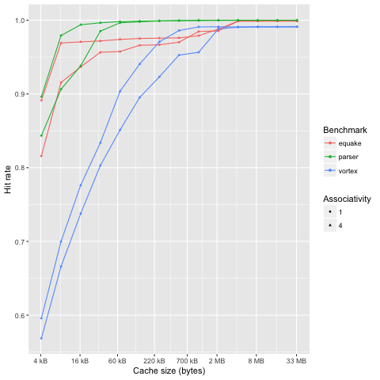
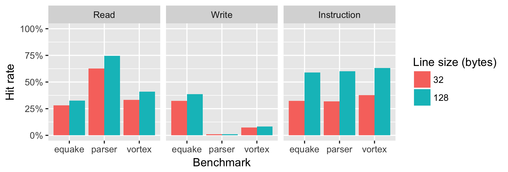
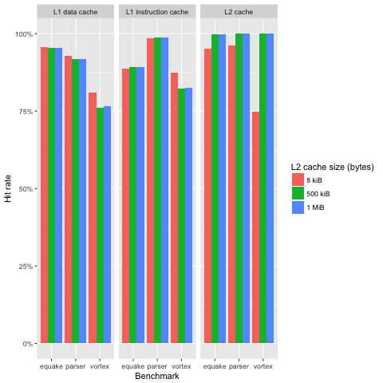
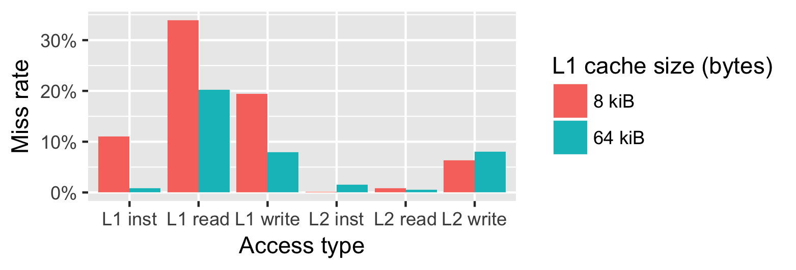
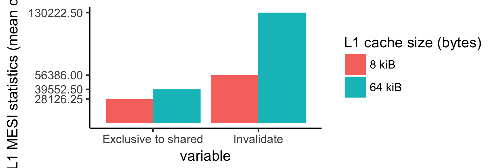

Introduction
============

We have been collaborating with a group of other students to automate the Simics
benchmarking in the git repository published at
https://github.com/myrjola/comparch_labs. The data used for our figures and
tables and the code to generate them are published in the same repository. The
majority of the lab time has been spent developing the automation and doing data
gathering. We have discussed our findings actively with the repository
collaborators, but also took care to conduct our own benchmarks and write our
own analysis.

3.2 Collecting statistics from simple cache
===========================================

The performance results are given in @tbl:cache_statistics_results. It is clear
that the parser benchmark has the best cache performance because it has the
highest hit rate. The vortex benchmark has the worst performance only scoring a
hit 56.9 percent of the time.

| Benchmark | Inst hit rate | Read hit rate | Write hit rate | Hit rate |
|-----------|---------------|---------------|----------------|----------|
| parser    |         92.8% |         87.2% |          63.4% |    84.3% |
| equake    |         79.3% |         87.1% |          80.9% |    81.6% |
| vortex    |         58.7% |         74.8% |          28.2% |    56.9% |
: Cache performance with default settings {#tbl:cache_statistics_results}

3.3 Determining benchmark working set size
==========================================

{#fig:hit_rate_graph}

By increasing the cache size the amount of conflict and capacity misses will
decrease. Because the cache has been warmed up in our benchmark, there should be
very few compulsory misses. The cache size at the point when the hit rate
stabilizes should give us an approximation of the program's working set. A
visualization of the hit rate is presented in @fig:hit_rate_graph. We also
tested the performance by increasing the associativity to 4 with the aim of
decreasing conflict misses in order to get a better approximation. The graph
suggests that the parser benchmark has the smallest working set at approximately
60kB. The working set of the vortex benchmark is around 2MB. The equake
benchmark has the largest working set. We estimate it is approximately 4MB.

3.4 Minimal instruction and data caches
=======================================

{#fig:minimal_cache_graph}

The performance using one cache line with different sizes is presented in
@fig:minimal_cache_graph. Using one cache line will give us a hint of the
spatial locality of the data. A line size of 32 bytes is quite small and will
only perform well if the data is accessed sequentially. My intuition says that
code is accessed mostly in this manner. The program counter will keep on
increasing until a branch happens. The UltraSparc T1 processor has instructions
of 32 bits, so without branches we should see a hit rate of 7/8 with a line size
of 32 bits and a 31/32 hit rate for a line size of 128 @ultrasparct1. However,
the performance doesn't come close to these values. Maybe there's more branches
in the benchmarks than in typical code. One thing to note is that the
instruction fetch hit rate almost doubles with the larger line size.

The data reads and writes share the same cache, so it is very likely that they
will interfere with each other. We see a big variance between the benchmarks.
The parser has the most sequential reads, but the worst write performance. The
equake benchmarks has the best write performance.

The question was about comparing relative locality of data against instruction
accesses. The data suggests that instruction accesses tend to follow the
principles of temporal and spatial locality quite well. Data access is very much
dependent on the benchmark. The parser benchmark achieves higher read hit rate
than the code, but both the parser and vortex suffer of bad write performance.

3.5 Collecting statistics from a cache hierarchy
================================================

The performance for the cache hierarchy for different sizes of L2 cache is given
in @fig:cache_hierarchy_graph. The first question was to assess how effective
the L2 cache is at collecting misses from the L1 level. We would argue that the
L2 cache performs very well, because the hit rate is very high for every
benchmark.

The second question was related to how the size of the L2 cache changes its
performance. We choose to analyze the performance in the vortex benchmark, which
has the most variance in the L2 results. The small size of 8 KiB has
significantly lower hit rate than the 500 kiB and 1 MiB L2 caches. The
difference between 500 kiB and 1 MiB is negligible, so it doesn't make sense to
invest in a larger L2 cache for this benchmark. Choosing between 8 kiB and 500
kiB is a tradeoff between cost and performance. In the next section we will give
a useful metric for assessing the performance between the different sizes.

{#fig:cache_hierarchy_graph}

Next we will calculate the average memory access time. We will use the
following formula to calculate it.

$$ 3 + L1_{\text{miss rate}} * (10 + L2_{\text{miss rate}} * 200) $$

The average access times are given in @tbl:amat_table. We calculated them by
aggregating the statistics for all the benchmarks. As expected the access time
gets shorter by increasing the cache size.

| L2 cache size | Average memory access time (cycles) |
|---------------|-------------------------------------|
| 8 kiB         |                              6.1996 |
| 500 kiB       |                              4.1795 |
| 1 MiB         |                              4.1769 |
: Average memory access time for the cache hierarchies {#tbl:amat_table}

3.6 Application tuning for a given cache hierarchy
==================================================

| AMAT (cycles) | L2 lines | DC line size | DC lines | IC lines | DC assoc | L2 assoc | DC hit rate | IC hit rate | L2 hit rate |
|---------------|----------|--------------|----------|----------|----------|----------|-------------|-------------|-------------|
|      10.69258 |       32 |           16 |       16 |        8 |        1 |        4 |        0.88 |        0.69 |        0.84 |
|      10.69258 |       32 |           16 |       16 |        8 |        1 |        4 |        0.88 |        0.69 |        0.84 |
|      11.02387 |       32 |           64 |       16 |        8 |        1 |        4 |        0.85 |        0.69 |        0.85 |
|      11.02387 |       32 |           64 |       16 |        8 |        1 |        4 |        0.85 |        0.69 |        0.85 |
|      11.13431 |       32 |           32 |       16 |        8 |        1 |        4 |        0.84 |        0.69 |        0.85 |
|      11.13431 |       32 |           32 |       16 |        8 |        1 |        4 |        0.84 |        0.69 |        0.85 |
|      11.26225 |       16 |           16 |       16 |        8 |        1 |        4 |        0.88 |        0.69 |        0.83 |
|      11.26225 |       16 |           16 |       16 |        8 |        1 |        4 |        0.88 |        0.69 |        0.83 |
|      11.37848 |       32 |           64 |        8 |        8 |        1 |        4 |        0.82 |        0.69 |        0.86 |
|      11.37848 |       32 |           64 |        8 |        8 |        1 |        4 |        0.82 |        0.69 |        0.86 |
|      11.53585 |       32 |           32 |        8 |        8 |        1 |        4 |        0.81 |        0.69 |        0.86 |
|      11.53585 |       32 |           32 |        8 |        8 |        1 |        4 |        0.81 |        0.69 |        0.86 |
|      11.56691 |       16 |           64 |       16 |        8 |        1 |        4 |        0.85 |        0.68 |        0.84 |
|      11.56691 |       16 |           64 |       16 |        8 |        1 |        4 |        0.85 |        0.68 |        0.84 |
|      11.73972 |       16 |           32 |       16 |        8 |        1 |        4 |        0.84 |        0.68 |        0.84 |
|      11.73972 |       16 |           32 |       16 |        8 |        1 |        4 |        0.84 |        0.68 |        0.84 |
|      11.90727 |       32 |           64 |        4 |        8 |        1 |        4 |        0.78 |        0.69 |        0.87 |
|      11.90727 |       32 |           64 |        4 |        8 |        1 |        4 |        0.78 |        0.69 |        0.87 |
|      12.04599 |       16 |           64 |        8 |        8 |        1 |        4 |        0.82 |        0.68 |        0.84 |
|      12.04599 |       16 |           64 |        8 |        8 |        1 |        4 |        0.82 |        0.68 |        0.84 |
|      12.18663 |       16 |           32 |        8 |        8 |        1 |        4 |        0.81 |        0.68 |        0.85 |
|      12.18663 |       16 |           32 |        8 |        8 |        1 |        4 |        0.81 |        0.68 |        0.85 |
|      12.29470 |        8 |           16 |       16 |        8 |        1 |        4 |        0.88 |        0.68 |        0.80 |
|      12.29470 |        8 |           16 |       16 |        8 |        1 |        4 |        0.88 |        0.68 |        0.80 |
|      12.43491 |        8 |           64 |       16 |        8 |        1 |        4 |        0.84 |        0.68 |        0.82 |
: Average memory access time for the gemm benchmark {#tbl:gemm_stats}

In choosing the most suitable cache we have to take both performance and cost
metrics into account. Most of the performance metrics can be generated by
Simics, but we plan to use Cacti 5.3 to gain access time, power and area
overheads. We use the default settings from the Cacti web interface. What we
found out by testing Cacti is that it doesn't work for small caches. At least
the results seem to be illogical with access times of 1e39 ns for many of our
cache configurations. Because of this bug we were unable find the optimal
configuration with regard to all metrics.

We performed 584 tests and chose the average memory access time as the most
suitable performance metric. We calculate the AMAT in the same manner as in 3.5
with the same miss penalties, we would have liked to use dynamic miss penalties
based on the cache configuration, but that was not possible due to the Cacti
bugs discussed earlier. The gemm benchmark has been run 100 million cycles after
the first magic breakpoint.

The top-25 best performing configurations are given in @tbl:gemm_stats. The
blocked matrix multiply works well with very small caches. Even the L2 cache can
be very small without too much performance degradation. Without being able to do
assess all metrics with Cacti we have to hazard a guess on the most balanced
configuration. We would like to choose the 23rd best configuration for the
application, because that is the best one with an L2 cache of only 8 lines and
still with good performance.

4.4 Multithreaded performance study
===================================

{#fig:multithreaded}

The miss rates for the multithreaded benchmark are given in @fig:multithreaded.
The results for the L1 cache are averaged over all the caches. What we can
observe is that the miss rates decrease substantially for the L1 cache when we
quadruple its size, this is expected because there is likely a lot of conflict
misses with the smaller cache. The miss rates for L2 instruction fetch and write
increases when L1 cache is enlarged. The main reason is that earlier the L1
conflict misses got served by the L2 cache but with the larger L1 cache most of
the conflict misses become hits and the thus there are less hits overall in the
L2 cache.

{#fig:multithreaded_mesi}

MESI statistics for the L1 caches are given in @fig:multithreaded_mesi. The
values are the arithmetic mean of all the statistics on the different
processors. The L1 cache is write through, therefore there are no
'modified'-transactions. The exclusive to shared statistics are increased
because it is more likely that any given address is available in the larger
caches. This also leads to a dramatic increase in invalidates because more data
is shared in a larger cache and thus a write has a higher probability to
invalidate more data than with the smaller cache.

5.5 Critical sections
===================================
1. The data is most of the time inconsistent when using `./lab1.5 -t critical -c
   pthreads`, increasingly so when adding threads to the execution. This is
   explained by race conditions because there is no synchronization. When one
   thread has read the counter value it should be locked from from reading and
   writing by other threads until the value has been incremented/decremented.

2. Adding the `enter_critical()` and `exit_critical()` makes the data consistent across executions by using mutexes.

3. Dekker's algorithm

    a. The variables are marked volatile in order to protect false writes from concurrently accessing threads because of compiler optimizations that would not create problems in a single-threaded execution.

    b. The CPU's out-of-order execution causes the inconsistency of data.

4. Memory fence Implementation, in `enter_critical()`:

    ```c
    if(thread == 1){
            flag[1] = true;
            MFENCE();
            while(flag[0]){
                if(turn != 1){
                    flag[1] = false;
                    while(turn != 1){
                        //Busy wait
                    }
                    flag[1] = true;
                }
            }
    }
    MFENCE();
    ```
5. Atomic increment & decrement

    Using the non-atomic instructions, the data is inconsistent. This is because there is no protective methods for the data. The memory location can be accessed by another thread while it is in the middle of the other CPU's pipeline, containing the old value before the other CPU has written into yet.

    Using atomic instructions, specifically the `lock`-instruction, a data atomicity is ensured by system-level methods. On older CPUs of the Intel family, the instruction locked the memory bus for the duration of the operation, but from P6 forward, the instruction enforces cache-locking. This guarantees exclusive ownership of the cache-line for this data during the operation. Then the cache-coherency mechanisms will ensure that the data is correct after the operation. @inteldev


6. Atomic compare & exchange

    Using non-atomic instructions, the data is yet again inconsistent. Mostly for same reasons as described above. Using CAS here is also the risk of an ABA-problem, where the other thread can write memory twice so that the resulting bits are same but the counter value does not keep track of this. Using the `lock`-version of `cmpxchgl` results in consistent data. It ensures that the data being read for comparison has not changed meanwhile.

7. Runtime comparison, critical vs. atomic operations

    As the data in @tbl:incdec_perf_table shows, critical sections are much slower. The time for Pthreads would vary significantly over different execution rounds, the time presented in the table is worst case recorded. We can see that instruction-level methods are much faster than software-level protective methods. They both induce stalling in the CPUs but instruction-level methods can reduce the stalls to be only the length of the instruction.


8. Runtime comparison, atomic vs. non-atomic operations

    Comparing the instruction-level methods in @tbl:incdec_perf_table, we can see that atomic instructions are slower as they induce stalling, but are a necessary for data consistency. CAS operations are slower but they offer more flexibility as they are not limited to increment/decrement operations, and could be used to implement complicated functions with good performance and data integrity.

| Property                  | Pthreads      | Dekker        | Atomic inc/dec| Non-atomic inc/dec| Atomic CAS     | Non-atomic CAS|
| ------------:             | :------------ | :-----------  | :-----------  | :-----------      | :-----------   | :-----------  |
|Average execution time:    | 1.2349 s      | 0.3516 s      | 0.0430 s      | 0.0100 s          | 0.1139 s       | 0.0332 s      |
: Runtime performance comparison table {#tbl:incdec_perf_table}

<!-- |Avg. iterations/s:| 8.0981e+05    | 2.8442e+06    | 2.3257e+07    | 9.9984e+07        | 8.7765e+06     | 3.0160e+07    | -->

Bibliography
============

<!-- The bibliography gets populated here automatically thanks to
pandoc-citeproc. -->
