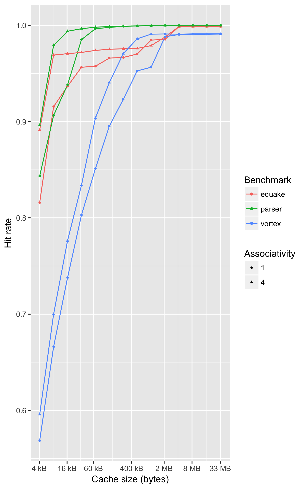
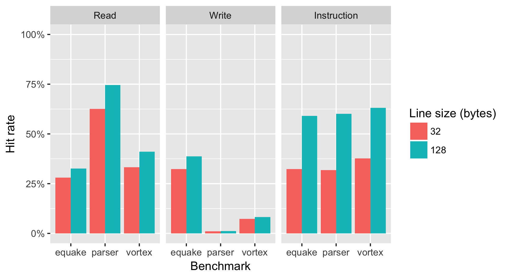
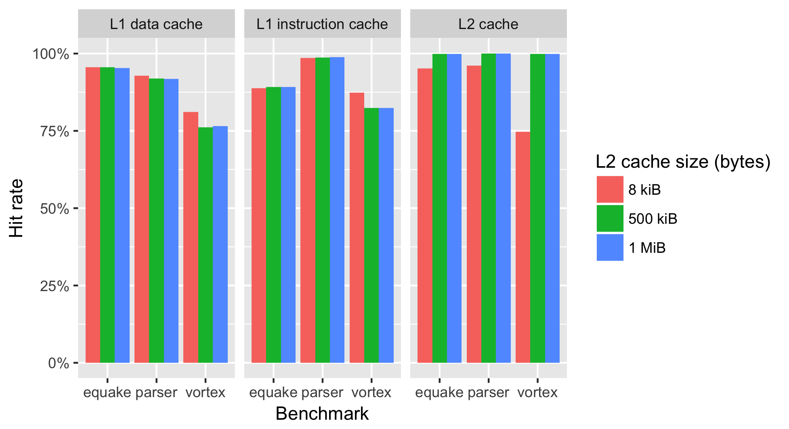
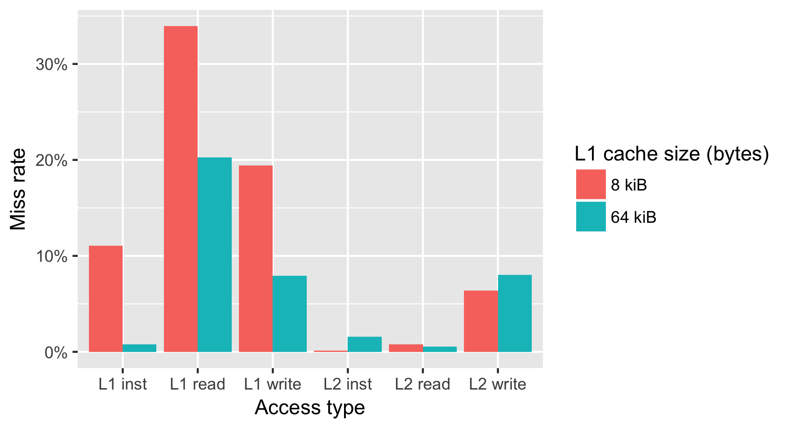

3.2 Collecting statistics from simple cache
===========================================

The performance results are given in @tbl:cache_statistics_results. It is clear
that the parser benchmark has the best cache performance because it has the
highest hit rate. The vortex benchmark has the worst performance only scoring a
hit 56.9 percent of the time.

| Benchmark | Inst hit rate | Read hit rate | Write hit rate | Hit rate |
|-----------|---------------|---------------|----------------|----------|
| parser    |         92.8% |         87.2% |          63.4% |    84.3% |
| equake    |         79.3% |         87.1% |          80.9% |    81.6% |
| vortex    |         58.7% |         74.8% |          28.2% |    56.9% |
: Cache performance with default settings {#tbl:cache_statistics_results}

3.3 Determining benchmark working set size
==========================================

By increasing the cache size the amount of conflict and capacity misses will
decrease. Because the cache has been warmed up in our benchmark, there should be
very few compulsory misses. The cache size at the point when the hit rate
stabilizes should give us an approximation of the program's working set. A
visualization of the hit rate is presented in @fig:hit_rate_graph. We also
tested the performance by increasing the associativity to 4 with the aim of
decreasing conflict misses in order to get a better approximation. The graph
suggests that the parser benchmark has the smallest working set at approximately
60kB. The working set of the vortex benchmark is around 2MB. The equake
benchmark has the largest working set. We estimate it is approximately 4MB.

{#fig:hit_rate_graph}

3.4 Minimal instruction and data caches
=======================================

The performance using one cache line with different sizes is presented in
@fig:minimal_cache_graph. Using one cache line will give us a hint of the
spatial locality of the data. A line size of 32 bytes is quite small and will
only perform well if the data is accessed sequentially. My intuition says that
code is accessed mostly in this manner. The program counter will keep on
increasing until a branch happens. The UltraSparc T1 processor has instructions
of 32 bits, so without branches we should see a hit rate of 7/8 with a line size
of 32 bits and a 31/32 hit rate for a line size of 128 @ultrasparct1. However,
the performance doesn't come close to these values. Maybe there's more branches
in the benchmarks than in typical code. One thing to note is that the
instruction fetch hit rate almost doubles with the larger line size.

The data reads and writes share the same cache, so it is very likely that they
will interfere with each other. We see a big variance between the benchmarks.
The parser has the most sequential reads, but the worst write performance. The
equake benchmarks has the best write performance.

The question was about comparing relative locality of data against instruction
accesses. The data suggests that instruction accesses tend to follow the
principles of temporal and spatial locality quite well. Data access is very much
dependent on the benchmark. The parser benchmark achieves higher read hit rate
than the code, but both the parser and vortex suffer of bad write performance.

{#fig:minimal_cache_graph}

3.5 Collecting statistics from a cache hierarchy
================================================

The performance for the cache hierarchy for different sizes of L2 cache is given
in @fig:cache_hierarchy_graph. The first question was to assess how effective
the L2 cache is at collecting misses from the L1 level. We would argue that the
L2 cache performs very well, because the hit rate is very high for every
benchmark.

The second question was related to how the size of the L2 cache changes its
performance. We choose to analyze the performance in the vortex benchmark, which
has the most variance in the L2 results. The small size of 8 KiB has
significantly lower hit rate than the 500 kiB and 1 MiB L2 caches. The
difference between 500 kiB and 1 MiB is negligible, so it doesn't make sense to
invest in a larger L2 cache for this benchmark. Choosing between 8 kiB and 500
kiB is a tradeoff between cost and performance. In the next section we will give
a useful metric for assessing the performance between the different sizes.

{#fig:cache_hierarchy_graph}

Next we will calculate the average memory access time. We will use the
following formula to calculate it.

$$
3 + L1_{\text{miss rate}}*(10 + L2_{\text{miss rate}}*200)
$$

The average access times are given in @tbl:amat_table. We calculated them by
aggregating the statistics for all the benchmarks. As expected the access time
gets shorter by increasing the cache size.

| L2 cache size | Average memory access time (cycles) |
|---------------|-------------------------------------|
| 8 kiB         |                              6.1996 |
| 500 kiB       |                              4.1795 |
| 1 MiB         |                              4.1769 |
: Average memory access time for the cache hierarchies {#tbl:amat_table}

4.4 Multithreaded performance study
===================================

The miss rates for the multithreaded benchmark are given in @fig:multithreaded.
The results for the L1 cache are averaged over all the caches. What we can
observe is that the miss rates decrease substantially for the L1 cache when we
quadruple its size, this is expected because there's a lot of conflict misses
with the smaller cache.

TODO: talk about the MESI stats

{#fig:multithreaded}

Bibliography
============

<!-- The bibliography gets populated here automatically thanks to
pandoc-citeproc. -->
