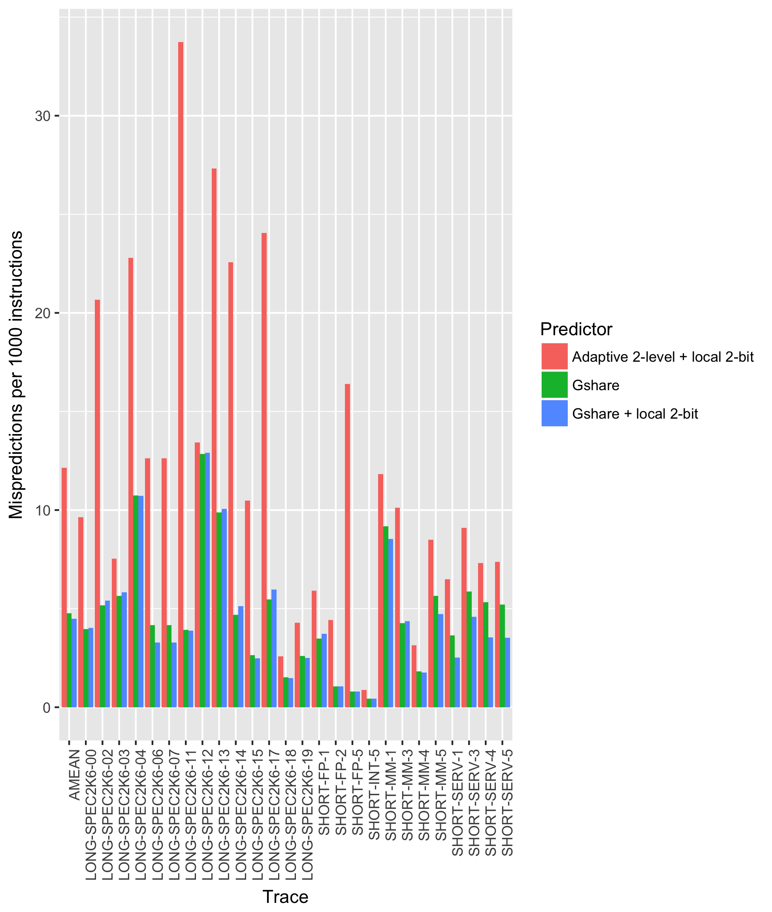

Introduction
============

We have been collaborating with a group of other students to automate the Simics
benchmarking in the git repository published at
https://github.com/myrjola/comparch_labs. The data used for our figures and
tables and the code to generate them are published in the same repository. The
majority of the lab time has been spent developing the automation and doing data
gathering. We have discussed our findings actively with the repository
collaborators, but also took care to conduct our own benchmarks and write our
own analysis.

2.3 Collecting IPC statistics using the MAI
===========================================

The recorded IPCs of each benchmark is presented in @tbl:ipc_stats. The equake
benchmark has the highest IPC of almost 2 and the vortex benchmark has the worst
IPC of under 0.9.

| Benchmark | Instructions per cycle |
|-----------|------------------------|
| vortex    |              0.8933801 |
| parser    |              1.1425188 |
| equake    |              1.9896457 |
: Instructions per cycle performance for the benchmarks {#tbl:ipc_stats}

2.4 Collecting data about the effect of superscalar pipeline width on IPC
=========================================================================

As the data in @tbl:ipc_width suggests, increase in width does increase IPC in the beginning, due to increased ILP. The increase does not scale however as shown by the diminishing returns in performance. This is most likely because of execution traps such as the wrong-size and load-miss load replay traps @ajaleel in the program code that cause the reorder buffer to be flushed on exception, rolling back to the pointer to last memory address before the exception. A mispredict in branch prediction causes the same effect.

| Instruction width| Buffer size    | IPC          | % change      |
| :-------------   | :------------- | :----------  | :----------   |
| 1	               | 32	            | 0,5211	   |               |
| 2	               | 32	            | 0,7337	   | 28,98 %       |
| 4	               | 32	            | 0,8961	   | 18,13 %       |
| 8	               | 32	            | 0,9484	   | 5,51 %        |
| 16               | 32	            | 0,9166	   | -3,47 %       |
| 1	               | 64	            | 0,5382	   |               |
| 2	               | 64	            | 0,7758	   | 30,63 %       |
| 4	               | 64	            | 0,9695	   | 19,98 %       |
| 8	               | 64	            | 1,0300	   | 5,88 %        |
| 16               | 64	            | 1,0038	   | -2,62 %       |
: IPC table with varying width and buffer size configurations {#tbl:ipc_width}

The optimal width for a pipeline seems to be 4. At this point the increase in performance vs. cost is at its peak.

2.5 Collecting data about the effect of memory latency on OoO efficiency
========================================================================

We chose the equake benchmark for this task. The IPC statistics for different
penalties is given in @tbl:ipc_penalty_stats. We can clearly see that increasing
the penalties will have a negative impact on performance. The impact of
increasing cache penalty is higher than that of increasing the memory penalty.
The results suggest that out-of-order processing masks small penalties very well
because it's likely there is always a couple of instructions not dependent on
the load instructions. Once the penalties get long enough the cpu starts
stalling to wait on the memory transactions to finish.

| Read penalty | Write penalty | Memory penalty | Instructions per cycle |
|--------------|---------------|----------------|------------------------|
|            1 |             1 |             10 |              1.9979500 |
|            2 |             2 |             10 |              1.6909622 |
|            5 |             5 |             10 |              1.2146641 |
|            1 |             1 |             20 |              1.8118661 |
|            1 |             1 |             50 |              1.4248578 |
: IPC performance for the equake benchmark with different penalties {#tbl:ipc_penalty_stats}

3.1 Branch predictor study
==========================

{#fig:branch_predictors}

Inspired by the course book @hennesycomparch chapter 3.3 we implemented a
tournament predictor and tried out two different global predictors in
combination with the classic 2-bit local predictor. Initially we chose to use
the already implemented Gshare predictor with the 2-bit local predictor. We
tweaked the history length to 16 so that we would fit the storage budget of 65KB
optimally. After that we tried to improve the performance by replacing Gshare
with a 2-level adaptive predictor using 2-bits for history and $4 \times 2$-bits
for prediction, so in other words it is a (2,2) predictor.

The performance comparison is presented in @fig:branch_predictors, the metric
used is mispredicts per 1000 instructions. The arithmetic mean (AMEAN in the
figure) of the mispredicts per 1000 instructions is 4.78 for the Gshare
predictor and 4.48 for our tournament predictor using Gshare and a local 2-bit
predictor. We achieved a marginal improvement over the baseline. The tournament
predictor using 2-level adaptive predictor and a local 2-bit predictor performed
significantly worse with an arithmetic mean of 12.1. The reason is likely that
the Gshare predictor uses a history of length 16 and the adaptive predictor only
has a history length of 2, which is insufficient to predict more complex
patterns. The source code for our Gshare + local 2-bit tournament predictor is
given in Appendix A.

Appendix A: Code for assignment 3.1
===================================

## Contents of `predictor.h`

```cpp
#ifndef _PREDICTOR_H_
#define _PREDICTOR_H_

#include "tracer.h"
#include "utils.h"

enum ChosenPredictor {
  GSHARE,
  LOCAL_PREDICTOR
};

class PREDICTOR {

private:
  UINT32 globalHistoryRegister;
  UINT32 *gsharePredictionTable;
  UINT32 *localPredictionTable;
  UINT32 *tournamentPredictionTable;
  UINT32 historyLength;
  UINT32 numEntries;

public:
  // The interface to the four functions below CAN NOT be changed
  PREDICTOR(void);
  bool GetPrediction(UINT32 PC);
  void UpdatePredictor(UINT32 PC, bool resolveDir, bool predDir,
                       UINT32 branchTarget);
  void TrackOtherInst(UINT32 PC, OpType opType, UINT32 branchTarget);

  // Contestants can define their own functions below
  UINT32 localIndex(UINT32 PC);
  UINT32 tournamentIndex(UINT32 PC);
  UINT32 gshareIndex(UINT32 PC);
  enum ChosenPredictor tournamentPrediction(UINT32 PC);
  bool localPrediction(UINT32 PC);
  bool gsharePrediction(UINT32 PC);
};

#endif
```

## Contents of `predictor.cc`


```cpp
#include "predictor.h"

// Unused parameter macros to silence compiler warnings.
// Taken from http://stackoverflow.com/a/12199209
#define MON_Internal_UnusedStringify(macro_arg_string_literal) \
  #macro_arg_string_literal
#define MONUnusedParameter(macro_arg_parameter) \
  _Pragma(MON_Internal_UnusedStringify(unused(macro_arg_parameter)))

enum {
  // We are using a 2-bit counter for all predictors
  GSHARE_CTR_MAX = 3,
  GSHARE_CTR_INIT = 2,
  LOCAL_PREDICTOR_CTR_MAX = 3,
  LOCAL_PREDICTOR_CTR_INIT = 2,
  TOURNAMENT_CTR_MAX = 3,
  TOURNAMENT_CTR_INIT = 2,

  HISTORY_LENGTH = 16,
} Constants;

// STORAGE BUDGET JUSTIFICATION
//
// Total storage budget: 65KB
//
// Counter size: 2^16 * 2-bits
// Number of predictors: 3
// Global history register size: 16 bits
// Total size = 2^16 * 2 * 3 + 16 = 393229 bits = 49KB

// PREDICTOR DESIGN
//
// Tournament predictor with local branch predictor and gshare correlating
// predictor. Used to predict conditional branches. All counters are 2-bits.

PREDICTOR::PREDICTOR(void) {
  historyLength = HISTORY_LENGTH;
  globalHistoryRegister = 0;
  numEntries = (1 << HISTORY_LENGTH);

  gsharePredictionTable = new UINT32[numEntries];
  localPredictionTable = new UINT32[numEntries];
  tournamentPredictionTable = new UINT32[numEntries];

  for (UINT32 i = 0; i < numEntries; i++) {
    gsharePredictionTable[i] = GSHARE_CTR_INIT;
    localPredictionTable[i] = LOCAL_PREDICTOR_CTR_INIT;
    tournamentPredictionTable[i] = TOURNAMENT_CTR_INIT;
  }
}

bool PREDICTOR::GetPrediction(UINT32 PC) {
  enum ChosenPredictor chosenPredictor = tournamentPrediction(PC);

  if (chosenPredictor == GSHARE) {
    return gsharePrediction(PC);
  }
  return localPrediction(PC);
}

void PREDICTOR::UpdatePredictor(UINT32 PC, bool resolveDir, bool predDir,
                                UINT32 branchTarget) {
  MONUnusedParameter(PC);
  MONUnusedParameter(predDir);
  MONUnusedParameter(branchTarget);

  UINT32 tournamentIdx = tournamentIndex(PC);
  UINT32 tournamentCounter = tournamentPredictionTable[tournamentIdx];
  UINT32 gshareIdx = gshareIndex(PC);
  UINT32 gshareCounter = gsharePredictionTable[gshareIdx];
  UINT32 localIdx = localIndex(PC);
  UINT32 localCounter = localPredictionTable[localIdx];

  // Update the tournament predictor.
  bool localPred = localPrediction(PC);
  bool gsharePred = gsharePrediction(PC);
  if (resolveDir == gsharePred && resolveDir != localPred) {
    tournamentPredictionTable[tournamentIdx] = SatIncrement(tournamentCounter,
                                                            TOURNAMENT_CTR_MAX);
  } else if (resolveDir == localPred && resolveDir != gsharePred) {
    tournamentPredictionTable[tournamentIdx] = SatDecrement(tournamentCounter);
  }

  // Update the gshare and local prediction table.
  if (resolveDir == TAKEN) {
    gsharePredictionTable[gshareIdx] = SatIncrement(gshareCounter, GSHARE_CTR_MAX);
    localPredictionTable[localIdx] =
        SatIncrement(localCounter, LOCAL_PREDICTOR_CTR_MAX);
  } else {
    gsharePredictionTable[gshareIdx] = SatDecrement(gshareCounter);
    localPredictionTable[localIdx] = SatDecrement(localCounter);
  }

  // Update the global history register.
  globalHistoryRegister = (globalHistoryRegister << 1);

  if (resolveDir == TAKEN) {
    globalHistoryRegister++;
  }
}

void PREDICTOR::TrackOtherInst(UINT32 PC, OpType opType, UINT32 branchTarget) {
  // This function is called for instructions which are not conditional
  // branches, just in case someone decides to design a predictor that uses
  // information from such instructions. We expect most contestants to leave
  // this function untouched.

  MONUnusedParameter(PC);
  MONUnusedParameter(opType);
  MONUnusedParameter(branchTarget);

  return;
}

UINT32 PREDICTOR::localIndex(UINT32 PC) {
  return PC % numEntries;
}

UINT32 PREDICTOR::tournamentIndex(UINT32 PC) {
  return localIndex(PC);
}

UINT32 PREDICTOR::gshareIndex(UINT32 PC) {
  return (PC ^ globalHistoryRegister) % numEntries;
}

enum ChosenPredictor PREDICTOR::tournamentPrediction(UINT32 PC) {
  UINT32 tournamentCounter = tournamentPredictionTable[localIndex(PC)];

  if (tournamentCounter > TOURNAMENT_CTR_MAX/2) {
    return GSHARE;
  }
  return LOCAL_PREDICTOR;
}

bool PREDICTOR::localPrediction(UINT32 PC) {
  UINT32 localCounter = localPredictionTable[localIndex(PC)];

  if (localCounter > LOCAL_PREDICTOR_CTR_MAX/2) {
    return TAKEN;
  }
  return NOT_TAKEN;
}

bool PREDICTOR::gsharePrediction(UINT32 PC) {
  UINT32 gshareCounter = gsharePredictionTable[gshareIndex(PC)];

  if (gshareCounter > GSHARE_CTR_MAX/2) {
    return TAKEN;
  }
  return NOT_TAKEN;
}
```

Bibliography
============

<!-- The bibliography gets populated here automatically thanks to
pandoc-citeproc. -->
